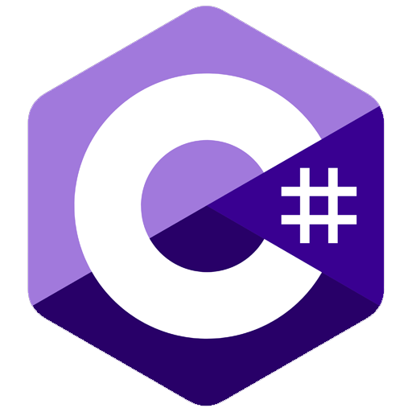
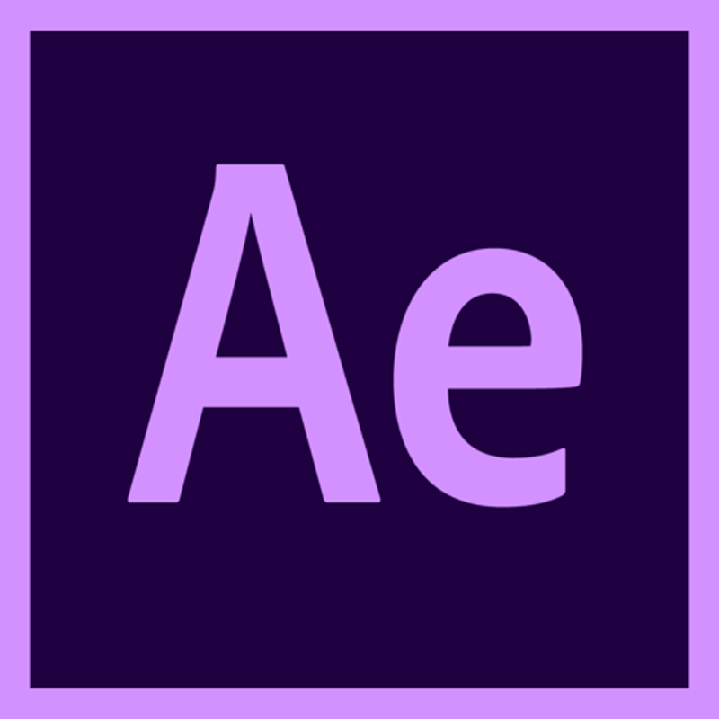

<!-- 짤 -->
</img>

### 👋Hello!

> <b> I'm student who make something fun!
> 
> Besides github, you can see my projects at my <a href="https://www.kaggle.com/tanteio">kaggle account</a>
> 
>  
> 
> 
> </a> 
> 
> 
> 
</a> 

 

|
  
|
      Main            <code></code>         Sub       <code></code>     <code></code>       <code></code>     <code></code>       Etc.      <code></code>   <code></code>      <code></code>        Learning      <code></code>               
|
|--|--|

<!--   -->

## About me

* #### Hello!
  * ###### I'm a person who is living in Viet Nam
  * ###### Currently in 1rd year of AI engineering
  * ###### I like everything related to human speech especially anime voice acting and the way use voice to improve your quality of life
  * ###### I like anime a lot, that's why I have a lot of anime style clothes and accessories

* #### Free time activities
  * ###### Debate on social networks on many topics, this help me alot in critical thinking and problem presentation
  * ###### Watching anime, playing games, jogging and create memes (My favourite anime is Bocchi the rock and I love this!)
